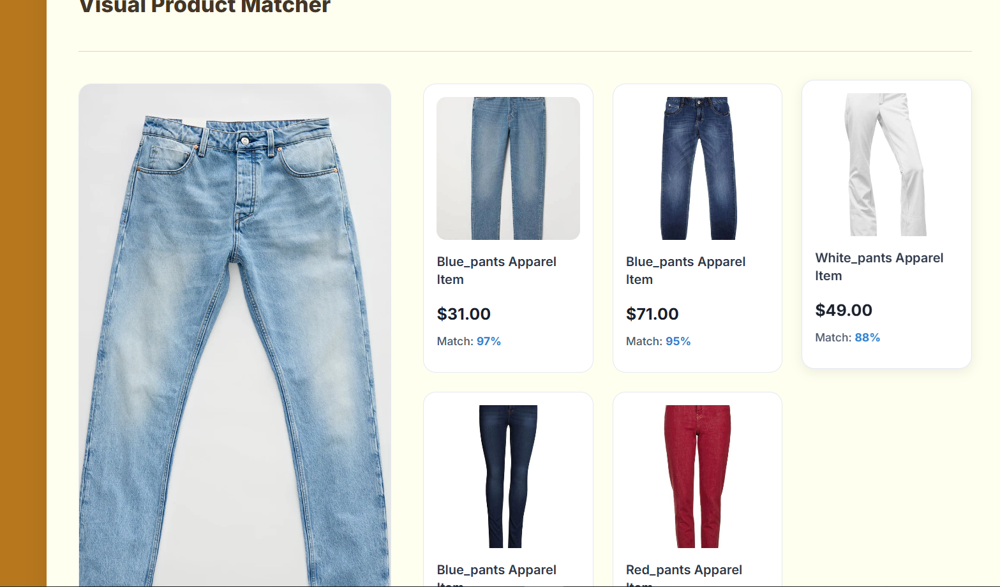

## Visual Product Matcher: AI-Powered Search Engine
This project is a full-stack web application that allows users to find visually similar products by uploading an image. It leverages a deep learning model (OpenAI's CLIP) to understand the visual content of images and performs a high-speed similarity search against a diverse product catalog.

The application features a clean, responsive user interface built with React.js and a robust backend API powered by Python and FastAPI.

## Application Screenshots

